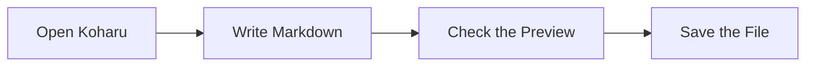

# Today's Notes

Today, I’m using Koharu to write some Markdown.

## To-Do

- Write some sample text
- Check the preview
- Save the file

We aim to create a **simple and easy-to-use editor**.

> A tool that lets you focus on writing.

# Mermaid Example

