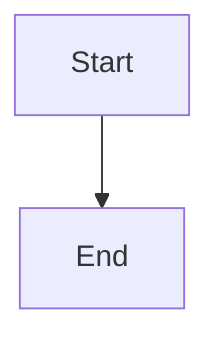

# Koharu Quick Win Improvement Mini Spec

## 1. Purpose

Koharuの既存機能を大きく変更せず、短期間でユーザー体験を改善する。

今回の対象は、実装負荷が比較的低く、ユーザーが改善を認識しやすい以下の5機能とする。

1. Preview Onlyモード
2. アウトライン表示
3. Mermaid画像出力
4. 最近使ったファイル
5. Markdownツールバー

画像貼り付け機能は、画像ファイル管理およびファイル移動時のリンク切れ対応が必要となるため、今回のスコープには含めない。

---

# 2. Feature 1: Preview Only Mode

## Objective

Markdownを編集せず、完成した文書を閲覧する際に、編集画面を非表示にしてプレビューを全幅表示できるようにする。

## Functional Requirements

Koharuに以下の3つの表示モードを設ける。

* Edit
* Split
* Preview

### Edit Mode

* Markdown編集画面のみ表示する
* プレビュー画面は非表示にする

### Split Mode

* Markdown編集画面とプレビュー画面を同時に表示する
* 現在の標準表示をSplit Modeとして扱う

### Preview Mode

* Markdown編集画面を非表示にする
* プレビュー画面を利用可能な領域全体に表示する
* Mermaid、テーブル、コードブロックなど、既存のプレビュー機能を維持する

## UI Requirements

メイン画面上部に表示モード切り替えUIを配置する。

例：

```text
[ Edit ] [ Split ] [ Preview ]
```

アイコンを使用する場合も、Tooltipで各モード名を表示する。

## State Requirements

* 表示モードの切り替えによって編集中の内容を失わない
* スクロール位置は可能な範囲で維持する
* 最後に選択した表示モードをアプリ終了後も記憶する
* 新しいファイルを開いた場合も、前回の表示モードを維持する

## Acceptance Criteria

* Previewを選択すると編集画面が完全に非表示になる
* プレビュー領域が横幅全体に広がる
* Splitを選択すると元の分割表示に戻る
* 表示モードを切り替えても未保存の編集内容が保持される
* アプリ再起動後も最後の表示モードが復元される

---

# 3. Feature 2: Document Outline

## Objective

長いMarkdown文書内を、見出し一覧から素早く移動できるようにする。

## Functional Requirements

* Markdown内の見出しを解析する
* `#`から`######`までを対象とする
* 見出し階層をツリー形式またはインデント形式で表示する
* 見出しをクリックすると、該当箇所へ移動する
* Markdown編集中に見出しが変更された場合、アウトラインを更新する

例：

```text
Overview
  Background
  Requirements
    Functional Requirements
    Non-functional Requirements
  Next Steps
```

## UI Requirements

* 左または右サイドバーにOutlineパネルを追加する
* Outlineパネルは表示／非表示を切り替えられる
* 文書に見出しが存在しない場合は、空状態を表示する

空状態例：

```text
No headings found
```

## Behavior Requirements

Edit ModeまたはSplit Modeの場合：

* 見出しクリック時にエディタ内の該当行へ移動する
* 可能であればカーソルも該当見出しへ移動する

Preview Modeの場合：

* 見出しクリック時にプレビュー内の該当見出しへ移動する

## Performance Requirements

* キー入力ごとの同期処理でUIをブロックしない
* 必要に応じてdebounceを使用する
* 大きなMarkdownファイルでも編集操作を妨げない

## Acceptance Criteria

* 文書内の見出しが階層構造で表示される
* 見出しクリックで正しい位置へ移動する
* 見出しの追加、削除、変更がアウトラインへ反映される
* 見出しがない文書でもエラーにならない
* Outlineパネルを非表示にできる

---

# 4. Feature 3: Mermaid Image Export

## Objective

Koharuで表示したMermaid図を、他の文書やプレゼンテーションで再利用できるようにする。

## Functional Requirements

各Mermaid図に以下の操作を追加する。

* Export as PNG
* Export as SVG
* Copy Image

## Export as PNG

* Mermaid図をPNG画像として保存する
* 保存先はユーザーが選択できる
* 背景色は現在のプレビュー表示と整合させる
* 出力画像がぼやけない解像度とする

## Export as SVG

* Mermaid図をSVGファイルとして保存する
* Mermaidで生成されたSVGを可能な限り保持する
* ファイル名の初期値を自動生成する

例：

```text
mermaid-diagram-20260801-0420.svg
```

## Copy Image

* Mermaid図を画像としてクリップボードへコピーする
* 他のアプリへ貼り付け可能とする
* 実装負荷が高い場合、初回リリースではPNG／SVG保存を優先し、Copy Imageは後続対応としてもよい

## UI Requirements

Mermaid図の右上などにExportメニューを表示する。

例：

```text
Export
  PNG
  SVG
  Copy Image
```

UIは図の閲覧を妨げないよう、常時表示またはHover時表示とする。

## Error Handling

* Mermaid構文エラーがある場合、Export操作を無効化する
* 保存に失敗した場合、ユーザーへエラーを表示する
* Export失敗によってアプリ全体をクラッシュさせない

## Acceptance Criteria

* 正常なMermaid図をPNGとして保存できる
* 正常なMermaid図をSVGとして保存できる
* 保存された画像がプレビュー表示と一致する
* Mermaid構文エラー時に不正なファイルを生成しない
* 複数のMermaid図がある場合、個別にExportできる

---

# 5. Feature 4: Recent Files

## Objective

ユーザーが直近で使用したMarkdownファイルを、素早く再度開けるようにする。

## Functional Requirements

* 最近開いたファイルを履歴として保存する
* 最近保存したファイルも履歴に含める
* 重複するファイルパスは1件として扱う
* 新しく開いたファイルをリスト上部へ移動する
* 最大10件を保持する
* 履歴を個別または一括で削除できる

## UI Requirements

以下のいずれか、または両方にRecent Filesを表示する。

* Welcome画面
* Fileメニュー

例：

```text
Recent Files

project-plan.md
meeting-notes.md
README.md
```

各項目には以下を表示する。

* ファイル名
* フルパスまたは親フォルダ
* 最終アクセス日時は任意

## Missing File Handling

履歴にあるファイルが移動または削除されている場合：

* アプリをクラッシュさせない
* 「File not found」と表示する
* 履歴から削除する選択肢を提供する

## Privacy Requirements

* ファイル履歴はローカル端末内にのみ保存する
* 外部サーバーへ送信しない

## Acceptance Criteria

* 開いたファイルがRecent Filesへ追加される
* 同じファイルを再度開いても重複しない
* Recent Filesからファイルを開ける
* 存在しないファイルを選択してもクラッシュしない
* 履歴を削除できる
* アプリ再起動後も履歴が保持される

---

# 6. Feature 5: Markdown Toolbar

## Objective

Markdown記法に詳しくないユーザーでも、基本的な書式を簡単に挿入できるようにする。

## Initial Toolbar Scope

初回リリースでは以下を対象とする。

* Heading
* Bold
* Italic
* Strikethrough
* Link
* Bullet List
* Numbered List
* Task List
* Quote
* Inline Code
* Code Block
* Table
* Mermaid

## Behavior Requirements

### Text Selected

テキストが選択されている場合、対応するMarkdown記法で囲む。

例：

選択文字列：

```text
Koharu
```

Bold実行後：

```markdown
**Koharu**
```

### No Text Selected

テキストが選択されていない場合、Markdown記法またはプレースホルダーを挿入する。

例：

Link：

```markdown
[link text](https://example.com)
```

Table：

```markdown
| Column 1 | Column 2 |
| --- | --- |
| Value 1 | Value 2 |
```

Mermaid：

````markdown

````

## Cursor Requirements

- 挿入後、ユーザーが入力すべき位置へカーソルを移動する
- 選択文字列を囲んだ場合、選択状態または適切なカーソル位置を維持する
- Undoで操作前の状態へ戻せる

## UI Requirements

- 編集画面上部にツールバーを表示する
- Edit ModeおよびSplit Modeで表示する
- Preview Modeでは非表示にする
- 各ボタンにTooltipを表示する
- アイコンだけでは意味が分かりにくい場合、テキストまたはTooltipで補足する

## Acceptance Criteria

- 各ボタンから正しいMarkdown記法を挿入できる
- 選択文字列を正しくMarkdown記法で囲める
- Undoが機能する
- Preview Modeではツールバーが非表示になる
- 挿入操作によって既存テキストが不意に削除されない

---

# 7. Out of Scope

今回のQuick Winリリースでは以下を対象外とする。

- 画像貼り付け
- assetsフォルダの自動作成
- Markdownファイル移動時の画像追従
- WYSIWYGテーブル編集
- Rich編集モード
- 全文検索
- バックリンク
- タグ管理
- AI機能
- 複数タブ
- クラウド同期

---

# 8. Implementation Priority

以下の順序で実装する。

1. Preview Only Mode
2. Recent Files
3. Document Outline
4. Markdown Toolbar
5. Mermaid Image Export

Preview Only Modeを最優先とする。

理由：

- 既存プレビュー機能を再利用できる
- UI上の変化が大きい
- 閲覧、画面共有、Mermaid確認など用途が広い
- 実装負荷が比較的低い

---

# 9. General Quality Requirements

- 既存のMarkdown編集機能を壊さない
- 既存ファイル形式を変更しない
- MarkdownファイルへKoharu独自メタデータを強制的に追加しない
- 未保存内容を失わない
- Windows環境で正常に動作する
- 既存のライト／ダークテーマと整合する
- 新しいUIにはTooltipまたは分かりやすいラベルを付ける
- ファイル操作やExport失敗によってアプリをクラッシュさせない

---

# 10. Codex Implementation Instructions

まず現在のKoharuコードベースを確認し、以下を特定すること。

1. エディタとプレビューのレイアウトを管理しているコンポーネント
2. アプリ設定の保存方式
3. Markdown見出し解析に利用可能な既存パーサー
4. Mermaidレンダリング処理
5. ファイル履歴を保存できる既存ストレージ
6. エディタの選択範囲およびカーソル操作API

実装前に、各機能について以下を簡潔に報告すること。

- 変更対象ファイル
- 実装方針
- 既存設計への影響
- 想定されるリスク

各機能は可能な限り独立した単位で実装すること。

既存の依存ライブラリで実現可能な場合、新しい依存関係を安易に追加しないこと。

実装後は、以下を確認すること。

- Build成功
- 既存テスト成功
- 新機能のテスト追加
- Light／Dark theme確認
- Edit／Split／Previewの各モード確認
- 未保存状態でのモード切り替え確認
- 大きなMarkdown文書での操作確認
- Mermaid複数図のExport確認
- Recent Filesの存在しないパス処理確認

実装完了後、変更内容、テスト結果、未解決事項をまとめて報告すること。
