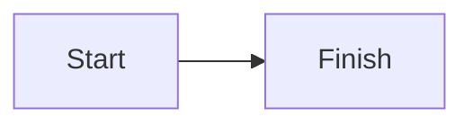

# Koharu Help Mermaid Syntax Design

## Goal

Make Koharu's built-in Mermaid support discoverable from Help without expanding the page into general advanced-feature documentation.

## Scope

- Add one dedicated Mermaid diagrams section to the Help dialog.
- Provide the section in both English and Japanese.
- Show a copyable fenced Mermaid example using a small left-to-right flowchart.
- Keep Excalidraw and other advanced features out of this change.

## Content

The English section explains that a fenced code block labeled `mermaid` renders as a diagram in Preview. The Japanese section communicates the same instruction naturally in Japanese.

Both locales show this exact source example:

````markdown

````

The section appears after Markdown basics and before keyboard shortcuts. A dedicated section is used because the multiline fenced syntax does not fit the existing one-line Markdown examples.

## Rendering

Extend the existing Help section model with an optional code example. Render it with semantic `pre` and `code` elements so line breaks and spacing remain visible and copyable. Reuse the Help dialog's existing visual language; add only narrowly scoped styling if the current code-block styles are insufficient.

## Testing

Update the Help dialog tests with separate English and Japanese assertions. Each locale must render:

- Its localized Mermaid section heading.
- Its localized explanation.
- The `mermaid` fence and flowchart source.

Run the focused Help dialog tests, then the full test suite and production build.
