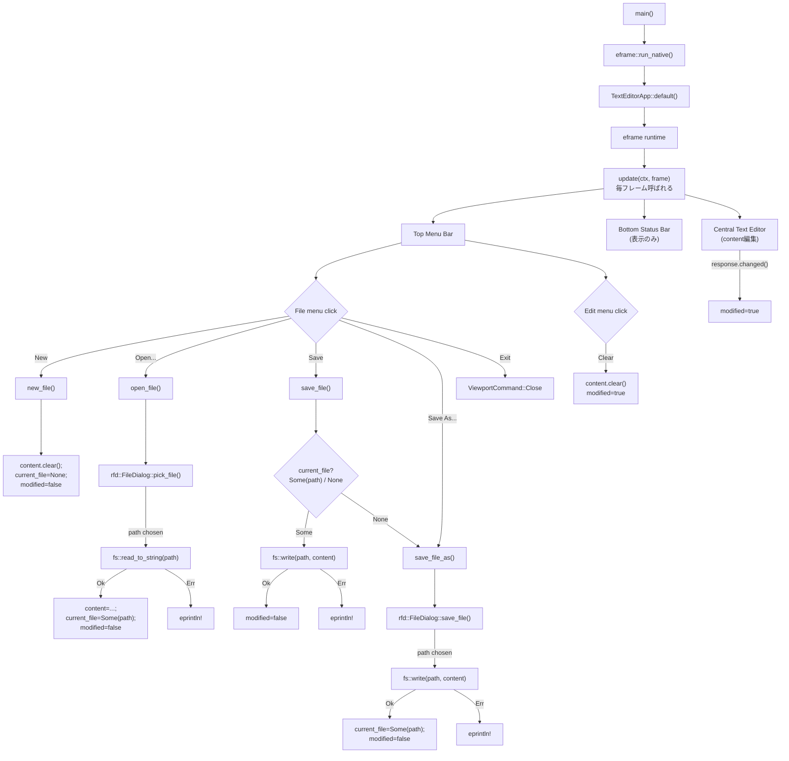

```mermaid
flowchart TB
  %% Entry point
  A["main()"] --> B["eframe::run_native()"]
  B --> C["TextEditorApp::default()"]
  C --> D["eframe runtime"]
  D --> E["update(ctx, frame)<br/>毎フレーム呼ばれる"]

  %% UI panels
  E --> M["Top Menu Bar"]
  E --> S["Bottom Status Bar<br/>(表示のみ)"]
  E --> T["Central Text Editor<br/>(content編集)"]

  %% Menu actions: File
  M --> F{"File menu click"}
  F -->|New| NF["new_file()"]
  F -->|"Open..."| OF["open_file()"]
  F -->|Save| SF["save_file()"]
  F -->|"Save As..."| SFA["save_file_as()"]
  F -->|Exit| X["ViewportCommand::Close"]

  %% Menu actions: Edit
  M --> G{"Edit menu click"}
  G -->|Clear| CL["content.clear()<br/>modified=true"]

  %% Text editor change
  T -->|"response.changed()"| MOD["modified=true"]

  %% Function internals
  OF --> FD1["rfd::FileDialog::pick_file()"]
  FD1 -->|"path chosen"| R1["fs::read_to_string(path)"]
  R1 -->|Ok| SET1["content=...;<br/>current_file=Some(path);<br/>modified=false"]
  R1 -->|Err| ERR1["eprintln!"]

  SF --> HAS{"current_file?<br/>Some(path) / None"}
  HAS -->|Some| W1["fs::write(path, content)"]
  W1 -->|Ok| SET2["modified=false"]
  W1 -->|Err| ERR2["eprintln!"]
  HAS -->|None| SFA

  SFA --> FD2["rfd::FileDialog::save_file()"]
  FD2 -->|"path chosen"| W2["fs::write(path, content)"]
  W2 -->|Ok| SET3["current_file=Some(path);<br/>modified=false"]
  W2 -->|Err| ERR3["eprintln!"]

  NF --> RESET["content.clear();<br/>current_file=None;<br/>modified=false"]


```